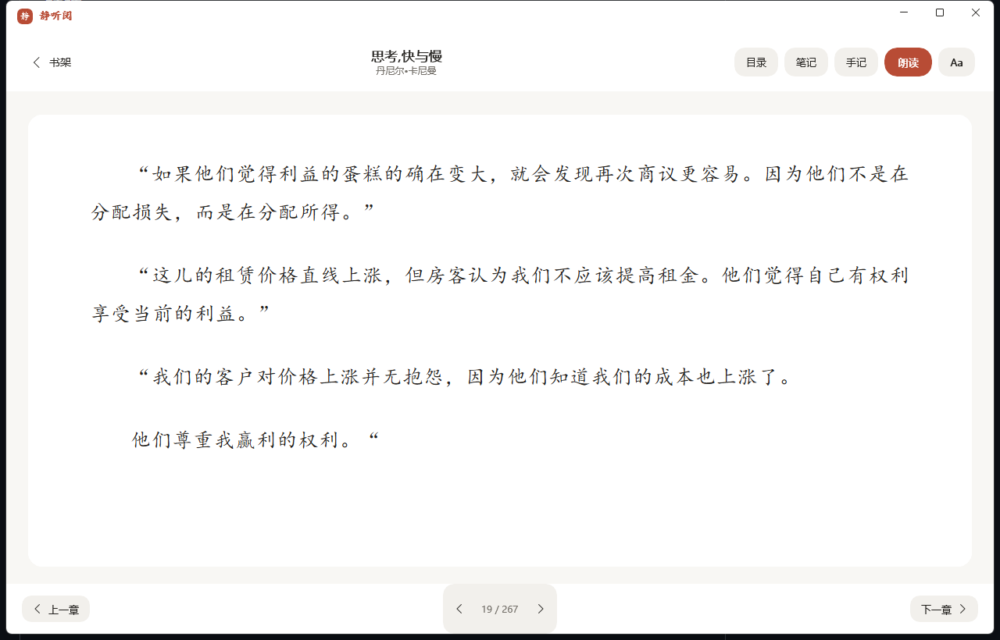

# 静听阅

一款安静、漂亮、适合长期使用的中文 EPUB 阅读器，听书靠本机神经语音，不依赖云端。

## 截图




## 特性

- **书架**：导入 EPUB、粘贴文字成稿、分类管理、阅读进度与「继续阅读」。
- **阅读**：多栏分页、键盘/触控板翻页、目录跳转、全书搜索、夜间/羊皮纸/纸白三主题。
- **字体**：楷体、宋体、仿宋、微软雅黑、黑体、等线、魏碑、隶书，每本书独立记忆字体/字号/主题/音色/语速/位置。
- **听书**：本地 Kokoro 神经 TTS，5 个中文音色，逐句高亮、自动翻页、可跨章节连读、定时停止；朗读时自动跳过网址、邮箱和数字引用。
- **笔记**：选中文字划线备注，悬停查看、回看原文，可导出竖版分享卡片。
- **隐私**：书、笔记、进度全在本机；AI 解读用你自己的 DeepSeek Key，不存明文。

## 技术栈

- C# / .NET 8 / WinUI 3，自包含免安装（不依赖目标机的 .NET）。
- 阅读引擎：内嵌 WebView2，CSS 多栏分页。
- 本地 TTS：Kokoro-ONNX + onnxruntime（纯 CPU），FastAPI 微服务随 App 拉起。

## 开发

```powershell
# 编译
dotnet build src\JingTingYue\JingTingYue.csproj -c Debug

# 运行（开发期）
.\src\JingTingYue\bin\Debug\net8.0-windows10.0.19041.0\win-x64\JingTingYue.exe
```

## 打包

```powershell
dotnet publish src\JingTingYue\JingTingYue.csproj -c Release -r win-x64 --self-contained true -o publish
```

把 `tts-server/`（含 `python/` 运行时、`model_uint8.onnx`、`voices.npz`）放到 `publish\tts-server\`，即得到绿色免安装目录。

## 数据位置

`%LOCALAPPDATA%\JingTingYue\`：books.json、notes.json、epubs\。

## 已知边界

- 仅支持 EPUB 与纯文本，不支持 PDF。
- 听书为 CPU 推理，长句有秒级合成延迟。
- AI 解读需自备 DeepSeek API Key，联网调用，可能产生费用。
